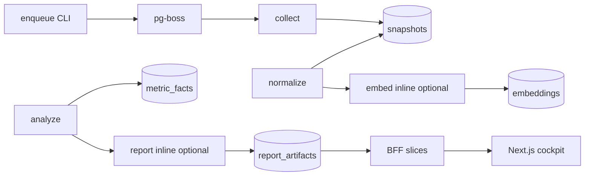

# ARCHITECTURE — Zeref

---

## Pipeline

---

## Layering

| Layer | Packages / apps |
|-------|-----------------|
| Contracts | `@zeref/contracts` — Zod DTOs, job I/O |
| Persistence | `@zeref/db` — Drizzle schema, migrations |
| Domain logic | `@zeref/instagram`, `@zeref/analytics`, `@zeref/reports` |
| Execution | `@zeref/worker` — pg-boss handlers |
| Presentation | `@zeref/web` — RSC pages + BFF + client globe |

`@zeref/domain` is a stub placeholder.

---

## ADR-governed decisions

- ADR-001 snapshot immutability
- ADR-004 Instagram merge-by-shortcode
- ADR-008 normalize→embed inline chain
- ADR-012 analyze→report inline chain
- ADR-016 BFF in apps/web (not apps/api)
- ADR-015 globe perf (wireframe today; 5.1 amends to point-cloud)

---

## Agent orchestration (meta)

Karpathy 3-stage council + GSD phases. Runtime truth: `docs/CURRENT_STATE.md`.
