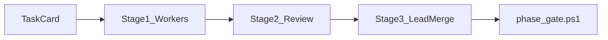

# Council orchestration — Zeref

Adapted from [Karpathy LLM Council](https://github.com/karpathy/llm-council) **3-stage deliberation** for **engineering governance**.

**Related:** [LEAD_ORCHESTRATOR.md](./LEAD_ORCHESTRATOR.md) · [MULTI_AGENT_WORKFLOW.md](./MULTI_AGENT_WORKFLOW.md) · [config/council/zeref-board.yaml](../config/council/zeref-board.yaml)

---

## Three stages

| Stage | Karpathy | Zeref |
|-------|----------|-------|
| **1 — Propose** | Parallel LLM responses | **2–3 worker chats** with scoped task cards |
| **2 — Review** | Anonymized peer ranking | Lead + [failures-checklist.md](./failures-checklist.md), ownership, verify impact |
| **3 — Synthesize** | Chairman final answer | Lead merge, user runs `phase_gate.ps1`, Planner sign-off |

---

## When council is mandatory (Stage 2)

- Edits to `packages/contracts/**`, `packages/db/**`
- Edits to `apps/worker/**` handlers or auto-chain policy
- Edits to `apps/web/app/api/**` BFF routes
- Changes to `docs/governance/phase-*-contract.md`, ADRs, `docs/api-contracts.md`
- New pg-boss job types or schema migrations

## Fast path (no full council)

- Pure CSS/visual in `apps/web/components/**` when no BFF contract change
- Documentation typos
- Test-only changes that don't alter contracts

---

## Cursor skills

| Skill | Stage |
|-------|-------|
| `.cursor/skills/council-propose-slice/SKILL.md` | 1 |
| `.cursor/skills/council-review-slice/SKILL.md` | 2 |
| `.cursor/skills/council-merge-slice/SKILL.md` | 3 |
| `.cursor/skills/run-verify-gate/SKILL.md` | Gate |

Invoke: *"Follow council-propose-slice for Phase 5.1 UI agent task card"*

---

## Worker task card template

See [WORKER_TASK_CARDS_QUEUE.md](./WORKER_TASK_CARDS_QUEUE.md).

---

## Do NOT

- Run multi-model OpenRouter council on every code change (cost)
- Skip Stage 2 on worker/schema/BFF changes
- Let Lead implement worker-owned paths in the same pass as task card writing
- Use fake telemetry to simulate Luke HUD without SSE wiring plan
