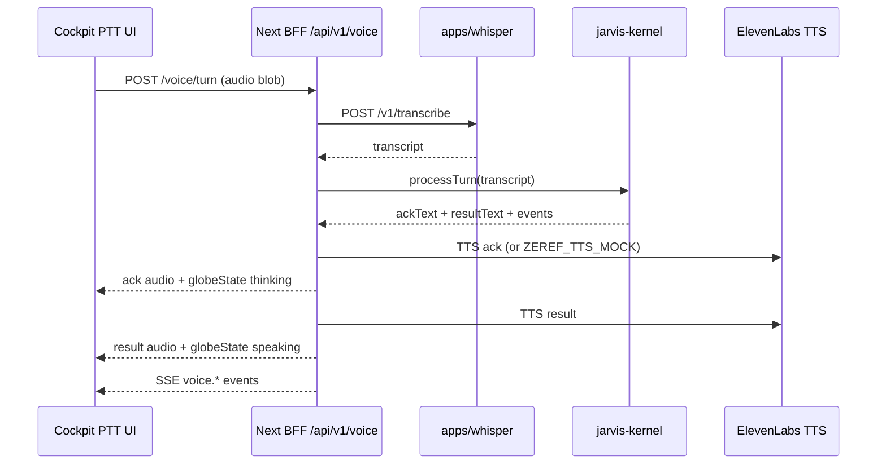

# Zeref — Phase 6 Contract (Discuss + Contract)

**Phase:** 6  
**Status:** **DRAFT** (requires Planner approval)  
**Theme:** Jarvis voice — Whisper STT sidecar, jarvis-kernel, ElevenLabs British TTS, PTT, two-phase speak, globe voice states, live AUDIO I/O

**Prerequisites:** Phase 5.1 implementation approved (`verify:phase-5.1` green; Luke HUD + SSE stub). Planner visual sign-off on 5.1 recommended before implementation spawn.

**Visual reference (carry-forward):** [docs/design/reference/lukebuildsai-jarvis-hud.jpeg](../design/reference/lukebuildsai-jarvis-hud.jpeg)

**Gap backlog:** ZR-020–ZR-026 ([GAP_BACKLOG.md](../GAP_BACKLOG.md))

---

## Open questions for Planner (with orchestrator recommendations)

| # | Question | Recommendation |
|---|----------|----------------|
| **Q1** | STT transport: sidecar HTTP vs WebSocket vs in-process | **`apps/whisper` Python sidecar** — `faster-whisper`; **`POST /v1/transcribe`** (multipart audio); **`GET /health`**; default `http://127.0.0.1:8765`. BFF proxies from Next — **no browser → whisper direct**. Optional `ZEREF_WHISPER_MOCK=1` for CI (fixture transcript). **ADR-020**. |
| **Q2** | TTS provider + voice persona | **ElevenLabs primary** — British Jarvis voice ID in env (`ELEVENLABS_VOICE_ID`); **OpenAI TTS fallback** only when ElevenLabs unavailable (document in ADR). **`ZEREF_TTS_MOCK=1`** returns fixture WAV/MP3 in CI — no live API keys. **ADR-022**. |
| **Q3** | Voice UX: Realtime API vs two-phase HTTP | **Reject Realtime API in Phase 6** (C30 carry-forward). **Two-phase speak:** (1) **ack** TTS within ~800ms of PTT release (`"Understood."` / intent-specific stub); (2) **result** TTS after kernel + tools complete. **ADR-021**. |
| **Q4** | Kernel scope: which tools in v1? | **Read-only cockpit tools only** — e.g. `get_latest_report_summary`, `get_panel_counts`, `get_pipeline_status` (fixture/DB read). **No** worker enqueue, collect, or Instagram scrape from voice in 6. OpenRouter **server-side only** via existing mock path in CI. **ADR-021**. |
| **Q5** | SSE: replace stub or dual-mode? | **Dual-mode stream** — keep `TelemetryEventSchema`; add `VoiceEventSchema` + `PipelineEventSchema` with `simulated: false` when live. Remove **SIMULATED** badge when stream is live. Worker bridge optional (BFF-only emission OK for 6). **ADR-024** extends ADR-019. |

### Proposed conditions (C51–C60)

| ID | Condition |
|----|-----------|
| **C51** | **`apps/whisper`** sidecar scaffolded — faster-whisper, `/v1/transcribe`, `/health`, README + dev start script; no GPU required for CI mock path. |
| **C52** | **`packages/jarvis-kernel`** — `processTurn()`, tool registry, **`PHASE6_CONTRACT_VERSION`** + Zod schemas exported from `@zeref/contracts` (phase6). |
| **C53** | **ElevenLabs British TTS primary**; **`ZEREF_TTS_MOCK=1`** for CI; no ElevenLabs/OpenAI keys in default CI workflow. |
| **C54** | **BFF voice routes** under `apps/web/app/api/v1/voice/**` — browser sends audio only to BFF; BFF calls whisper + kernel + TTS. **No API keys in client bundle.** |
| **C55** | **PTT UI** — hold-to-talk control (`data-testid="ptt-button"`); releases trigger turn; accessible label + optional `Space` hold (documented). |
| **C56** | **Two-phase speak** — ack audio plays before or while kernel runs; result audio after; both observable in UI transcript dock (placeholder shell from 5.1 optional). |
| **C57** | **Globe voice states** — `idle` \| `listening` \| `thinking` \| `speaking` on `globe-island` as `data-globe-voice-state`; visual delta per **ADR-023** (no ADR-015 perf regression). |
| **C58** | **Live AUDIO I/O** — replace static SIMULATED meters with mic input level (PTT) + output level (TTS playback); `data-testid="audio-io-live"` when live; hide `audio-io-simulated` when live. |
| **C59** | **`npm run verify:phase-6`** — chains `verify:phase-0` … `verify:phase-5.1`; mock STT/TTS; Playwright PTT + globe state smoke; C30 import guard updated to **allow** `@zeref/jarvis-kernel` only via BFF/server paths (not direct browser import of kernel). |
| **C60** | **No OpenRouter / Realtime / keys in browser**; no fake live telemetry — SSE events honest about `simulated` flag until worker bridge lands. |

**Contracts agent:** **PARTIAL** — phase6 voice schemas + `PHASE6_CONTRACT_VERSION` (Kernel agent + BFF).

**Data / Worker agents:** **SKIP** — no new pg-boss job types in Phase 6 unless Planner amends Q4.

---

## Goals

1. **Push-to-talk Jarvis** — operator holds PTT, speaks, receives British TTS ack + result.
2. **Sidecar STT** — local/dev faster-whisper; CI mock path without sidecar binary.
3. **jarvis-kernel** — server-side turn processing + read-only cockpit tools.
4. **Globe + AUDIO I/O** — voice states drive hero visuals and footer meters.
5. **Live SSE** — voice + pipeline events on existing `/api/v1/events/stream` (extend ADR-019).
6. **Verify** — `verify:phase-6` in CI (**Phase 0–6 gate**).
7. **Multi-agent delivery** — Whisper, Kernel, BFF, UI, Docs/QA in **separate chats** after Planner approval.

---

## Non-goals (out of scope)

| Area | Notes |
|------|--------|
| OpenAI Realtime / full duplex | Phase 6+ |
| Wake word / always-listening | Phase 6+ |
| `packages/zeref-memory` 4-tier brain | Phase 7 (ZR-030) |
| Voice-triggered worker enqueue | Phase 6+ unless Q4 amended |
| Browser OpenRouter / direct LLM | Forbidden |
| Replacing four-panel cockpit | ADR-017 preserved |
| GPU-whisper in CI | Mock only |

---

## Architecture (target)

---

## Layout / UX (delta from 5.1)

| Region | Phase 5.1 | Phase 6 |
|--------|-----------|---------|
| HUD header | Telemetry strip + SIMULATED | Telemetry live when SSE `simulated: false` |
| HUD footer | AUDIO I/O SIMULATED | Live mic/output meters + PTT |
| Globe hero | point-cloud idle rotation | State-driven motion (ADR-023) |
| Conversation | optional static shell | transcript lines for ack + result |

**Preserve C48 testids** unless superseded (`audio-io-simulated` hidden when live).

---

## BFF routes (proposed)

| Route | Behavior |
|-------|----------|
| `GET /api/v1/events/stream` | **Extend** — add `event: voice` + `event: pipeline` (see ADR-024) |
| `POST /api/v1/voice/turn` | Multipart audio → `{ transcript, ackAudio, resultAudio, phases, globeState }` |
| `GET /api/v1/voice/health` | Whisper sidecar + TTS mock status for Settings/debug |

---

## Verify: `npm run verify:phase-6`

| Check | Requirement |
|-------|-------------|
| Contract + ADRs | phase-6-contract, ADR-020–024 |
| C51–C53 | whisper + kernel + TTS mock unit tests |
| C54–C58 | Playwright: PTT visible, globe voice state transitions (mock turn) |
| C59 | phases 0–5.1 still pass |
| C60 | No forbidden browser imports; mock flags only in CI |

**CI env (proposed):** `ZEREF_TTS_MOCK=1`, `ZEREF_WHISPER_MOCK=1`, `ZEREF_LLM_MOCK=1`, `ZEREF_BFF_FIXTURE=1`, `ZEREF_PHASE51_UI=1`, `ZEREF_PHASE6_VOICE=1` (Playwright enforce).

---

## ADRs (Phase 6 — draft)

| ADR | Owner | Topic |
|-----|-------|--------|
| [ADR-020](./adr/ADR-020-whisper-stt-sidecar.md) | Whisper | faster-whisper sidecar (Q1) |
| [ADR-021](./adr/ADR-021-jarvis-kernel-two-phase-speak.md) | Kernel | kernel + two-phase speak + tools (Q3–Q4) |
| [ADR-022](./adr/ADR-022-elevenlabs-tts-mock.md) | Kernel | ElevenLabs + `ZEREF_TTS_MOCK` (Q2) |
| [ADR-023](./adr/ADR-023-globe-voice-states.md) | UI | globe idle/listening/thinking/speaking (C57) |
| [ADR-024](./adr/ADR-024-live-sse-voice-events.md) | BFF | extend SSE stub → live voice events (Q5) |
| [ADR-018](./adr/ADR-018-verify-phase-5-harness.md) | QA | extend for `verify:phase-6` |

---

## Acceptance criteria

- Planner approves Q1–Q5 and C51–C60.
- Multi-agent process: Lead did **not** implement domain code in discuss pass.
- `verify:phase-6` green locally + CI with mock STT/TTS.
- No theater: live badges only when stream/turn is real; mocks labeled in Settings.

---

## Agent ownership (after approval — separate chats)

| Order | Agent | Deliverables |
|-------|-------|----------------|
| 1 (parallel) | **Whisper** | `apps/whisper`, transcribe API, health, dev docs |
| 1 (parallel) | **Kernel** | `packages/jarvis-kernel`, TTS adapter, two-phase speak, contracts schemas |
| 2 (parallel) | **BFF/Voice** | `/api/v1/voice/*`, SSE extension, server wiring |
| 2 (parallel) | **Docs/QA** | `verify-phase-6.mjs`, CI Phase 0–6 gate |
| 3 | **UI** | PTT, live AUDIO I/O, globe states, Playwright, DESIGN_SYSTEM |
| — | **Lead** | Integrate reports; run verify; **STOP** until reports pasted |

**HARD RULE:** Lead does not implement domain code without agent reports.
