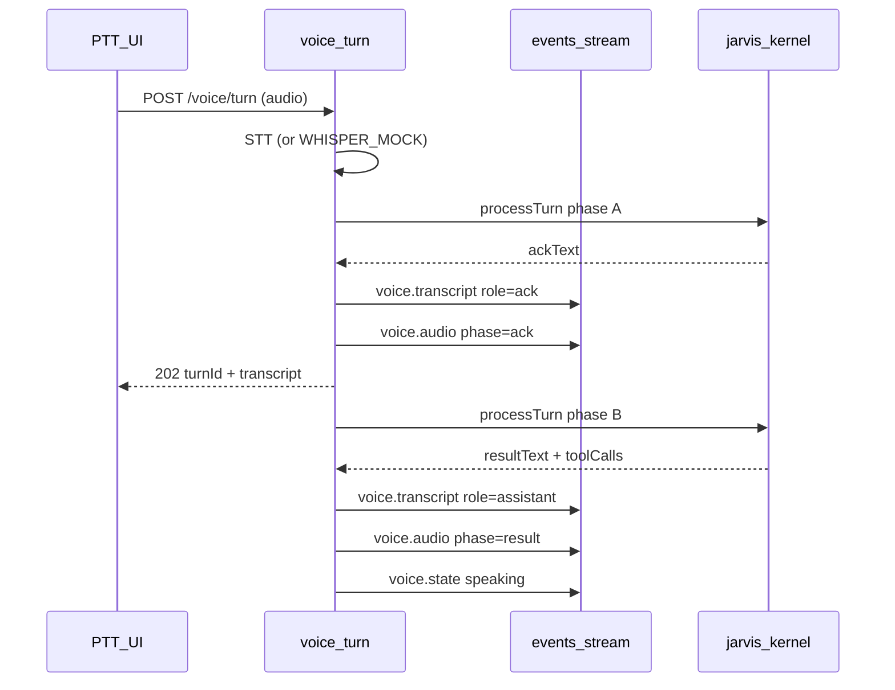

# Zeref — Phase 6 Contract (Implementation)

**Phase:** 6  
**Status:** **APPROVED** (Planner functional sign-off 2026-05-31)  
**Theme:** Jarvis voice — Whisper STT sidecar, jarvis-kernel, ElevenLabs British TTS, PTT, two-phase speak, globe voice states, live AUDIO I/O

**Sign-off evidence:** CI green @ `d9c589f`; hotfixes `9c5869f` / `358d757`; screenshot [`zeref-cockpit-6-d.png`](../design/reference/screenshots/zeref-cockpit-6-d.png) @ `3020d1e`. Tier-2 visual vs Luke — Phase 6.1 polish deferred.

**Prerequisites:** Phase 5.1 **APPROVED** (`verify:phase-5.1` green @ `abb9dec`; CI Phase 0–5.1).

**Visual reference (carry-forward):** [docs/design/reference/lukebuildsai-jarvis-hud.jpeg](../design/reference/lukebuildsai-jarvis-hud.jpeg)

**Gap backlog:** ZR-020–ZR-026 ([GAP_BACKLOG.md](../GAP_BACKLOG.md))

---

## Planner decisions (binding)

| # | Decision |
|---|----------|
| **Q1** | **APPROVED** — `apps/whisper` faster-whisper; `GET /health`, `POST /v1/transcribe`; `127.0.0.1:8765`; BFF proxy only; `ZEREF_WHISPER_MOCK=1` in CI. [ADR-020](./adr/ADR-020-whisper-stt-sidecar.md) |
| **Q2** | **APPROVED** — ElevenLabs British primary; OpenAI TTS fallback server-side; `ZEREF_TTS_MOCK=1` in CI. [ADR-022](./adr/ADR-022-elevenlabs-tts-mock.md) |
| **Q3** | **APPROVED** — Two-phase speak (ack → result); **no Realtime API**. **Amendment A:** live/dev delivery via **202 + SSE**; CI mock may use sync JSON. [ADR-021](./adr/ADR-021-jarvis-kernel-two-phase-speak.md) |
| **Q4** | **APPROVED** — Read-only tools only; **no worker enqueue**. Tools: `get_cockpit_summary`, `get_latest_report_headline`, `get_pipeline_status` (honest unavailable if worker absent). [ADR-021](./adr/ADR-021-jarvis-kernel-two-phase-speak.md) |
| **Q5** | **APPROVED** — Extend `GET /api/v1/events/stream`; `voice.*` + optional `pipeline`; honest `simulated`; no second URL. [ADR-024](./adr/ADR-024-live-sse-voice-events.md) |

### Conditions (C51–C60)

| ID | Condition |
|----|-----------|
| **C51** | **`apps/whisper`** sidecar — faster-whisper, `/v1/transcribe`, `/health`, README; CI uses mock path. |
| **C52** | **`packages/jarvis-kernel`** + `packages/contracts/src/phase6/` + `PHASE6_CONTRACT_VERSION`. |
| **C53** | ElevenLabs British TTS primary; **`ZEREF_TTS_MOCK=1`** in CI. |
| **C54** | BFF `apps/web/app/api/v1/voice/**` — browser never calls whisper/TTS/LLM directly. |
| **C55** | PTT `data-testid="ptt-button"` + accessible hold-to-talk. |
| **C56** | Two-phase UX — ack then result in transcript + audio order (**Amendment A** delivery). |
| **C57** | Globe `data-globe-voice-state` on `globe-island` (**Amendment C** — no bloom). |
| **C58** | Live AUDIO I/O `data-testid="audio-io-live"`; hide `audio-io-simulated` when live. |
| **C59** | **`npm run verify:phase-6`** chains 0–5.1 + phase-6; C30 guard allows server-only kernel. |
| **C60** | No browser keys; no fake-live telemetry. |

**CI env (binding):** `ZEREF_WHISPER_MOCK=1`, `ZEREF_TTS_MOCK=1`, `ZEREF_LLM_MOCK=1`, `ZEREF_BFF_FIXTURE=1`, `ZEREF_PHASE51_UI=1`, `ZEREF_PHASE6_VOICE=1`

---

## Amendment A — Two-phase delivery (Q3 / C56)

**Live/dev:** `POST /api/v1/voice/turn` returns **202** `{ turnId, transcript }` after STT. Ack + result **audio, transcripts, and globe states** arrive on **SSE** (`voice.audio`, `voice.transcript`, `voice.state`). All voice events include **`turnId`** for correlation.

**CI mock:** When `ZEREF_WHISPER_MOCK=1` + `ZEREF_TTS_MOCK=1` + `ZEREF_LLM_MOCK=1`, BFF **may** return **200** synchronous JSON with both audio blobs (zero-latency acceptable).

---

## Architecture (binding)

**Owners:** P6-C BFF + SSE; P6-D `VoiceController` subscribes for playback order.

---

## BFF routes (locked)

| Route | Behavior |
|-------|----------|
| `GET /api/v1/events/stream` | Extend — `voice.state`, `voice.transcript`, `voice.audio`, optional `pipeline` |
| `POST /api/v1/voice/turn` | Multipart audio → **202** `{ turnId, transcript }` (live) or **200** sync mock JSON (CI) |
| `GET /api/v1/voice/health` | Whisper sidecar + mock flags status |

---

## Goals

1. PTT Jarvis with British TTS two-phase speak.
2. Whisper sidecar + jarvis-kernel + honest live SSE.
3. Globe voice states + live AUDIO I/O.
4. `verify:phase-6` in CI (Phase 0–6 gate).
5. Multi-agent — separate chats; Lead integrates reports only.

---

## Non-goals

Realtime API, wake word, `zeref-memory`, voice worker enqueue, browser OpenRouter, GPU whisper in CI.

---

## Verify: `npm run verify:phase-6`

| Check | Requirement |
|-------|-------------|
| Contract + ADRs | phase-6, ADR-020–024 APPROVED |
| C51–C60 | mock STT/TTS + Playwright with `ZEREF_PHASE6_VOICE=1` |
| Chain | phases 0–5.1 still pass |

---

## ADRs

| ADR | Status |
|-----|--------|
| [ADR-020](./adr/ADR-020-whisper-stt-sidecar.md) | **APPROVED** |
| [ADR-021](./adr/ADR-021-jarvis-kernel-two-phase-speak.md) | **APPROVED** |
| [ADR-022](./adr/ADR-022-elevenlabs-tts-mock.md) | **APPROVED** |
| [ADR-023](./adr/ADR-023-globe-voice-states.md) | **APPROVED** |
| [ADR-024](./adr/ADR-024-live-sse-voice-events.md) | **APPROVED** |

---

## Implementation order (Planner)

1. **P6-A** Whisper + **P6-B** Kernel (parallel)
2. **P6-C** BFF/Voice + **P6-E** Docs/QA (parallel)
3. **P6-D** UI
4. User: `verify:phase-6` → CI → Planner sign-off — **DONE** 2026-05-31

**HARD RULE:** Lead does not implement domain code without agent reports.

---

## Acceptance (sign-off)

- [x] Planner approved Q1–Q5 and C51–C60.
- [x] `verify:phase-6` green locally + CI with mock STT/TTS.
- [x] UAT: Option A mocks — audible ack + result beeps; two-phase transcript.
- [x] Screenshot committed: `docs/design/reference/screenshots/zeref-cockpit-6-d.png`.
- [x] No browser API keys; honest SSE `simulated` flags.
