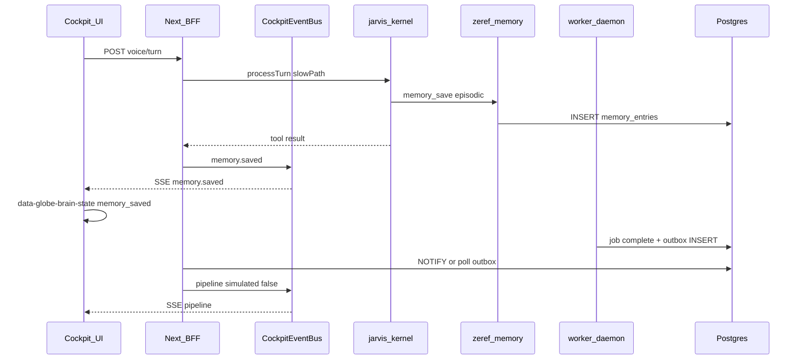

# Zeref — Phase 7 Contract (Implementation)

**Phase:** 7  
**Status:** **APPROVED WITH CONDITIONS** (Planner 2026-05-31)  
**Theme:** `packages/zeref-memory` — 4-tier brain + event→orb (Luke jarvis-orb pattern)

**Prerequisites:** Phase 6 **APPROVED** (`183acf9`, CI @ `d9c589f`, hotfixes `9c5869f`/`358d757`, screenshot @ `3020d1e`, governance @ `a3ebbde`).

**Gap backlog:** ZR-030, ZR-031, ZR-032 ([GAP_BACKLOG.md](../GAP_BACKLOG.md))

**Reference:** [jarvis-orb](https://github.com/TheStack-ai/jarvis-orb) · [lukebuildsai-jarvis-hud.jpeg](../design/reference/lukebuildsai-jarvis-hud.jpeg)

---

## Planner decisions (binding)

| # | Decision |
|---|----------|
| **Q1** | **APPROVED** — Postgres via `packages/db`; Drizzle migrations for `memory_entries`, `memory_entities`, `memory_relations`, `memory_observations`. `ZEREF_MEMORY_MOCK=1` for CI. No SQLite v1. [ADR-025](./adr/ADR-025-memory-postgres-schema.md) |
| **Q2** | **APPROVED** — Server-only writes: kernel `memory_save` / `memory_search` on slow path; worker hook for episodic pipeline entries. Optional read-only `GET /api/v1/memory/search?q=` for Settings/debug. No browser write. [ADR-026](./adr/ADR-026-kernel-memory-tools.md) |
| **Q3** | **APPROVED** — Extend `GET /api/v1/events/stream` with `memory.*` events; unified cockpit event bus (Amendment A). `data-globe-brain-state` orthogonal to `data-globe-voice-state`. [ADR-027](./adr/ADR-027-sse-brain-events-outbox.md) |
| **Q4** | **APPROVED** — Rule-based contradiction MVP: same `entity_id` + conflicting value → mark older `contradicted` + `memory.contradiction` SSE. LLM semantic contradiction → Phase 7.1+ |
| **Q5** | **APPROVED** — Worker→SSE bridge via Postgres outbox + NOTIFY/poll (Amendment B). Honest `simulated: true` when worker absent or mock. |

### Conditions (C61–C70)

| ID | Condition |
|----|-----------|
| **C61** | **`packages/zeref-memory`** — 4-tier API: `saveMemory`, `searchMemory`, `verifyMemory`, entity CRUD; tiers: `episodic` \| `semantic` \| `project` \| `procedural`. |
| **C62** | **`packages/contracts/src/phase7/`** — memory + brain event schemas; `PHASE7_CONTRACT_VERSION` = `7.0.0`. |
| **C63** | **Postgres schema** in `packages/db` — migrations; temporal scoring (30-day half-life constant). |
| **C64** | **`ZEREF_MEMORY_MOCK=1`** — fixture/in-memory adapter in CI; chains with `SKIP_DB_TESTS` / fixture patterns. |
| **C65** | **jarvis-kernel** — tools `memory_search`, `memory_save` on **slow path only** (ack latency preserved). |
| **C66** | **SSE** — `memory.saved`, `memory.search`, `memory.contradiction`, `memory.entity_changed` (+ existing `voice.*`, `pipeline`). |
| **C67** | **Globe** — `data-globe-brain-state`: `idle` \| `memory_saved` \| `searching` \| `contradiction` \| `entity_changed`; no bloom (ADR-015/023). |
| **C68** | **Pipeline SSE** — `simulated: false` when worker actually completed job via outbox. |
| **C69** | **Perf** — sub-100 ms dev target on mock bus; **150 ms CI tolerance** for attribute update after SSE emit. |
| **C70** | **`npm run verify:phase-7`** chains 0–6; `ZEREF_MEMORY_MOCK=1`, `ZEREF_PHASE7_BRAIN=1`. |

**CI env (binding):** Phase 6 flags + `ZEREF_MEMORY_MOCK=1`, `ZEREF_PHASE7_BRAIN=1`

---

## Amendment A — Unified cockpit event bus (BFF)

Generalize in-process bus (extend `getVoiceEventBus` → **`getCockpitEventBus`** or alias) so **voice + memory + pipeline** share one SSE fan-out in `apps/web/app/api/v1/events/stream/route.ts`. Do not add parallel global buses.

---

## Amendment B — Worker→SSE cross-process (Q5 / C68)

`scripts/worker.mjs` runs in a **separate Node process** from Next.js. In-memory bus cannot receive worker completions directly.

**Binding:**

1. Postgres **outbox table** `cockpit_sse_outbox` — worker `INSERT` on job complete; BFF SSE route drains via `LISTEN/NOTIFY` or short poll per connection.
2. **CI mock:** BFF may synthesize `pipeline` events when `ZEREF_MEMORY_MOCK=1` or worker absent — **`simulated: true`**.

Do **not** claim live worker bridge without cross-process transport.

---

## Amendment C — Kernel tool routing

Extend [`packages/jarvis-kernel/src/tools/registry.ts`](../../packages/jarvis-kernel/src/tools/registry.ts) keyword routing for `memory_search` / `memory_save` (like cockpit tools). `memory_save` after turn summary on slow path; must not block ack.

---

## Amendment D — Spawn waves

| Wave | Slices |
|------|--------|
| **1** | P7-A only (contracts + db + zeref-memory) |
| **2** | P7-B + P7-C + P7-E scaffold (verify shell; Playwright may skip until P7-D) |
| **3** | P7-D UI (brain states + TelemetryStrip) |
| **4** | P7-E finalize e2e `cockpit-brain-7.spec.ts` |

Max **2–3 parallel workers** after P7-A report.

---

## Architecture (binding)

### 4-tier model

| Tier | Zeref examples | Auto-classify signal |
|------|----------------|----------------------|
| **Episodic** | Voice turns, pipeline completions | `source: voice` \| `worker` |
| **Semantic** | User preferences, stable facts | low churn, no snapshot ID |
| **Project** | Snapshot IDs, report headlines | `@zeref/contracts` entity refs |
| **Procedural** | `verify:phase-N`, `dev:clean`, enqueue | workflow patterns |

---

## BFF routes (locked)

| Route | Behavior |
|-------|----------|
| `GET /api/v1/events/stream` | Extend — `memory.*`, `pipeline`, `voice.*` on unified bus |
| `GET /api/v1/memory/search?q=` | **Optional** read-only debug/Settings; mock when `ZEREF_MEMORY_MOCK=1` |
| `POST /api/v1/voice/turn` | Unchanged — kernel may call memory on slow path |

---

## Goals

1. Persistent 4-tier memory (`packages/zeref-memory`).
2. Event→orb mapping on cockpit globe (C67, C69).
3. Worker→SSE pipeline bridge via outbox (ZR-026).
4. Rule-based contradiction MVP (ZR-032 partial).
5. `verify:phase-7` in CI (Phase 0–7 gate).

---

## Non-goals

| Area | Notes |
|------|--------|
| Re-open Phase 6 voice | Frozen |
| Full Luke HUD clone | Phase 6.1 optional |
| MCP server / desktop orb app | Reference only |
| LLM contradiction | Phase 7.1+ |
| Browser memory write | Forbidden |
| Claude Mem / external SaaS | Defer |

---

## Verify: `npm run verify:phase-7`

| Check | Requirement |
|-------|-------------|
| Chain | phases 0–6 pass |
| Contracts | phase7 + `PHASE7_CONTRACT_VERSION` |
| Unit | `@zeref/zeref-memory` mock tests |
| Kernel | memory tools slow-path only |
| BFF | memory SSE + outbox drain test |
| E2E | `cockpit-brain-7.spec.ts` with `ZEREF_PHASE7_BRAIN=1` (Wave 4) |

---

## ADRs

| ADR | Status |
|-----|--------|
| [ADR-025](./adr/ADR-025-memory-postgres-schema.md) | **APPROVED** |
| [ADR-026](./adr/ADR-026-kernel-memory-tools.md) | **APPROVED** |
| [ADR-027](./adr/ADR-027-sse-brain-events-outbox.md) | **APPROVED** |

---

## Implementation order

1. **P7-A** Memory package + schema  
2. **P7-B** Kernel + **P7-C** BFF + **P7-E** scaffold (parallel)  
3. **P7-D** UI  
4. **P7-E** finalize e2e  
5. User: `verify:phase-7` → CI → Planner sign-off

**HARD RULE:** Lead does not implement domain code without agent reports.
