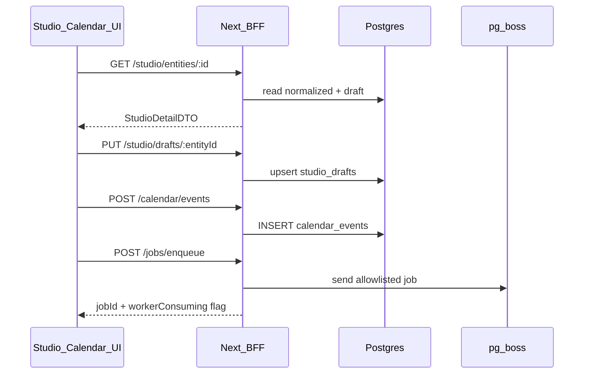

# Zeref — Phase 8 Contract (Implementation)

**Phase:** 8  
**Status:** **APPROVED WITH CONDITIONS** (Planner 2026-06-03)  
**Theme:** Studio editor + Calendar scheduling UX (left-stack product panels)

**Prerequisites:** Phase 7 **APPROVED** (`0e7f8d5`, `verify:phase-7` @ `0461bc1`, screenshot `zeref-cockpit-7-brain.png`).

**References:** [phase-5-contract.md](./phase-5-contract.md) (non-goals L57–58 closed) · [DESIGN_SYSTEM.md](../design/DESIGN_SYSTEM.md) · [lukebuildsai-jarvis-hud.jpeg](../design/reference/lukebuildsai-jarvis-hud.jpeg)

**Gap backlog:** ZR-044 (partial — BFF enqueue), ZR-012 (panel product depth)

---

## Planner decisions (binding)

| # | Decision |
|---|----------|
| **Q1** | **APPROVED** — Postgres `calendar_events` via `packages/db`; fixtures `fixtures/phase-8/`; `ZEREF_BFF_FIXTURE=1` in CI. [ADR-029](./adr/ADR-029-calendar-events-schema.md) |
| **Q2** | **APPROVED** — Studio read + `studio_drafts` (no snapshot mutation); `/cockpit/studio/[entityId]` editor. [ADR-028](./adr/ADR-028-studio-drafts-editor.md) |
| **Q3** | **APPROVED** — BFF `POST /api/v1/jobs/enqueue` with **Amendment F** allowlist (no `collect` from UI). [ADR-030](./adr/ADR-030-bff-job-enqueue.md) |
| **Q4** | **APPROVED** — `phase8-cockpit-v1` additive panel fields; migrate verify fixtures (Amendment G). |
| **Q5** | **APPROVED** — Manual scheduling MVP; cron daemon → Phase 8.1+; honest scheduler-absent badge. |

### Conditions (C71–C80)

| ID | Condition |
|----|-----------|
| **C71** | **`packages/contracts/src/phase8/`** — `CalendarEventSchema`, `StudioDraftSchema`, `JobEnqueueRequestSchema`, `CockpitSlicesSchemaV8`, `PHASE8_CONTRACT_VERSION` = `8.0.0`. |
| **C72** | **`packages/db`** migrations — `calendar_events`, `studio_drafts`. |
| **C73** | **BFF read** — `GET /api/v1/studio/entities/:id`, `GET /api/v1/calendar/events`, `GET /api/v1/calendar/events/:id`. |
| **C74** | **BFF write** — `POST/PATCH /api/v1/calendar/events`, `PUT /api/v1/studio/drafts/:entityId`, `POST /api/v1/jobs/enqueue`. |
| **C75** | **Studio UI** — `/cockpit/studio/[entityId]` editor; `data-testid="studio-editor"`. |
| **C76** | **Calendar UI** — week/list scheduler; `data-testid="calendar-scheduler"`. |
| **C77** | **RSC-first** — extend `loadCockpitSlices()`; no client refetch storm. |
| **C78** | **No snapshot mutation** — drafts ≠ collect re-scrape (C6). |
| **C79** | **Honest enqueue UX** — worker absent warning (Amendment J). |
| **C80** | **`npm run verify:phase-8`** chains 0–7; `ZEREF_PHASE8_PRODUCT=1`, `ZEREF_JOB_ENQUEUE_MOCK=1`. |

**CI env (binding):** Phase 7 flags + `ZEREF_PHASE8_PRODUCT=1`, `ZEREF_JOB_ENQUEUE_MOCK=1`, `ZEREF_BFF_FIXTURE=1`

---

## Amendment F — UI job allowlist (Q3)

**Exclude `collect` from cockpit UI enqueue.**

| Reason | Detail |
|--------|--------|
| Credentials | Collect needs live Instagram — not cockpit-safe default |
| Operator path | `scripts/enqueue-collect.mjs` remains CLI-only |
| Risk | Narrower allowlist per failures-checklist |

**Binding allowlist:** `normalize` | `embed` | `analyze` | `report`

Body: `{ jobType, snapshotId?, entityId?, calendarEventId? }` — validated with `@zeref/contracts` job input schemas (same as CLI).

---

## Amendment G — Cockpit slices schema version (Q4)

1. Add `packages/contracts/src/phase8/cockpit.ts` — `phase8-cockpit-v1` with additive optional fields: `status`, `scheduledAt`, `draftPreview`, `hasDraft`.
2. BFF returns `phase8-cockpit-v1` when Phase 8 active.
3. Update verify fixtures → `fixtures/phase-8/cockpit-slices.valid.json`.
4. Keep `panel-studio` / `panel-calendar` testids (C26 carry-forward).

Do **not** leave dual literals without P8-A migration plan.

---

## Amendment H — ADR-016 amendment

[ADR-016](./adr/ADR-016-bff-cockpit-slices.md) amended via [ADR-030](./adr/ADR-030-bff-job-enqueue.md): BFF may enqueue **only** via `POST /api/v1/jobs/enqueue` with Planner allowlist. Still no `@zeref/instagram` in web; slices routes read-only.

---

## Amendment I — Shared enqueue implementation

Add `apps/web/lib/jobs/enqueue-job.ts` (or `packages/jobs/` if extracted):

- Parse body with contract Zod schemas
- `boss.send` with same retry options as CLI scripts
- `ZEREF_JOB_ENQUEUE_MOCK=1` → `{ jobId, mocked: true }`

No duplicate allowlist in UI — BFF only.

---

## Amendment J — Honest enqueue UX (C79)

When enqueue succeeds but worker daemon absent (`ZEREF_WORKER_AVAILABLE` unset):

- Return **202** `{ jobId, queued: true, workerConsuming: false }` or UI warning badge
- Aligns with failures-checklist ZR-001

---

## Architecture (binding)

---

## BFF routes (locked)

| Route | Behavior |
|-------|----------|
| `GET /api/v1/cockpit/slices` | Returns `phase8-cockpit-v1` when Phase 8 active |
| `GET /api/v1/studio/entities/:id` | Normalized summary + draft overlay |
| `PUT /api/v1/studio/drafts/:entityId` | Upsert draft (no snapshot write) |
| `GET /api/v1/calendar/events` | List calendar events |
| `POST /api/v1/calendar/events` | Create event |
| `PATCH /api/v1/calendar/events/:id` | Update event |
| `POST /api/v1/jobs/enqueue` | Allowlisted enqueue (Amendment F) |

---

## Goals

1. Close Phase 5 non-goals: Studio editor + Calendar scheduling UX.
2. BFF job enqueue (ZR-044 partial).
3. `phase8-cockpit-v1` contracts + DB persistence.
4. `verify:phase-8` in CI (Phase 0–8 gate).

---

## Non-goals

| Area | Notes |
|------|--------|
| Research pipelines | Phase 9 |
| Instagram publish / live collect from UI | `collect` CLI only |
| Cron scheduler daemon | Phase 8.1+ |
| Re-open Phase 6 voice / Phase 7 memory | Frozen |
| Luke full HUD clone | Phase 6.1 optional |
| Multi-tenant auth | Phase 10 |
| Snapshot mutation | Forbidden (C6) |
| `@zeref/instagram` in web | Forbidden |

---

## Verify: `npm run verify:phase-8`

| Check | Requirement |
|-------|-------------|
| Chain | phases 0–7 pass |
| Contracts | phase8 + `phase8-cockpit-v1` fixture |
| BFF | studio/calendar/enqueue route tests |
| E2E | `cockpit-studio-8.spec.ts`, `cockpit-calendar-8.spec.ts` with `ZEREF_PHASE8_PRODUCT=1` |

---

## ADRs

| ADR | Status |
|-----|--------|
| [ADR-028](./adr/ADR-028-studio-drafts-editor.md) | **APPROVED** |
| [ADR-029](./adr/ADR-029-calendar-events-schema.md) | **APPROVED** |
| [ADR-030](./adr/ADR-030-bff-job-enqueue.md) | **APPROVED** (amends ADR-016) |

---

## Implementation order

1. **P8-A** Contracts + Data  
2. **P8-B** BFF + **P8-E** scaffold (parallel)  
3. **P8-C** Studio UI + **P8-D** Calendar UI (parallel)  
4. **P8-E** finalize e2e  

**HARD RULE:** Lead does not implement domain code without agent reports.
