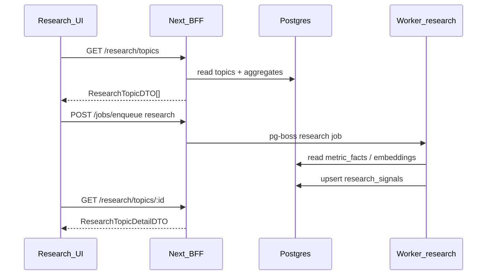

# Zeref — Phase 9 Contract (Implementation)

**Phase:** 9  
**Status:** **APPROVED WITH CONDITIONS** (Planner 2026-06-03)  
**Theme:** Research trend pipelines — replace Research placeholder with worker-backed topics + BFF + cockpit UX

**Prerequisites:** Phase 8 **APPROVED** (`e5dc5b6`, `verify:phase-8` green 2026-06-03).

**Parallel track:** Phase **6.1** UI-only polish runs in **separate worker chats** with strict file firewall (no overlap with P9 paths). Phase 9 is **primary**.

**References:** [phase-5-contract.md](./phase-5-contract.md) (Research non-goal closed) · [phase-8-contract.md](./phase-8-contract.md) · [DESIGN_SYSTEM.md](../design/DESIGN_SYSTEM.md)

**Gap backlog:** Phase 5 Research placeholder (L58), ZR-013 partial (pipeline telemetry remains 6.1 visual scope only)

---

## Planner decisions (binding)

| # | Decision |
|---|----------|
| **Q1** | **APPROVED** — New worker job type **`research`** aggregates trends from existing **`metric_facts`** + **`embedding_vectors`** (no re-scrape, no `@zeref/instagram` in handler). Operator may also enqueue via BFF allowlist extension. [ADR-031](./adr/ADR-031-research-postgres-schema.md) · [ADR-032](./adr/ADR-032-research-worker-bff.md) |
| **Q2** | **APPROVED** — Postgres tables **`research_topics`**, **`research_signals`** via `packages/db`; fixtures `fixtures/phase-9/`; `ZEREF_BFF_FIXTURE=1` in CI. |
| **Q3** | **APPROVED** — BFF read routes + optional topic create; **`phase9-cockpit-v1`** research panel fields (`trendScore`, `signalCount`, `lastComputedAt`). |
| **Q4** | **APPROVED** — `/cockpit/research` hub + `/cockpit/research/[topicId]` detail; `data-testid="research-hub"`; preserve `panel-research`. |
| **Q5** | **APPROVED** — **`npm run verify:phase-9`** chains 0–8; `ZEREF_PHASE9_RESEARCH=1`; Playwright `cockpit-research-9.spec.ts`. |

### Conditions (C81–C90)

| ID | Condition |
|----|-----------|
| **C81** | **`packages/contracts/src/phase9/`** — `ResearchTopicSchema`, `ResearchSignalSchema`, `ResearchTopicDetailSchema`, `CockpitSlicesSchemaV9`, `PHASE9_CONTRACT_VERSION` = `9.0.0`. |
| **C82** | **`packages/db`** migration — `research_topics`, `research_signals` (FK to normalized entities / snapshots where applicable). |
| **C83** | **Worker** — register **`research`** job; reads DB only; writes signals + topic aggregates; no snapshot mutation (C6). |
| **C84** | **BFF read** — `GET /api/v1/research/topics`, `GET /api/v1/research/topics/:id`. |
| **C85** | **BFF write (MVP)** — `POST /api/v1/research/topics` (create topic seed); enqueue **`research`** via existing `POST /api/v1/jobs/enqueue` with **Amendment L** allowlist extension. |
| **C86** | **Cockpit slices** — BFF returns `phase9-cockpit-v1` when Phase 9 active; research panel `insufficientData: false` in fixture mode. |
| **C87** | **Research UI** — hub lists topics; detail shows signals + trend score; honest empty state when no topics. |
| **C88** | **RSC-first** — extend `loadCockpitSlices()`; detail page server-fetches topic; no client refetch storm (C77 carry-forward). |
| **C89** | **No `@zeref/instagram` in web** — research UI/BFF read DB only (C30 carry-forward). |
| **C90** | **`npm run verify:phase-9`** chains 0–8; `ZEREF_PHASE9_RESEARCH=1`, `ZEREF_BFF_FIXTURE=1`, `ZEREF_JOB_ENQUEUE_MOCK=1`. |

**CI env (binding):** Phase 8 flags + `ZEREF_PHASE9_RESEARCH=1`

---

## Amendment L — Enqueue allowlist extension (Q1 / C85)

Extend Phase 8 Amendment F allowlist with **`research`** for cockpit-triggered recompute.

**Binding allowlist:** `normalize` | `embed` | `analyze` | `report` | **`research`**

**Still excluded:** `collect` (CLI only).

Body for research jobs: `{ jobType: "research", topicId? }` — validated in `@zeref/contracts`.

---

## Amendment M — Parallel file firewall (Phase 6.1)

Phase 9 workers **must not** edit:

- `apps/web/components/hud/**` (6.1-A owner)
- `apps/web/app/globals.css`, `tailwind.config.*` (6.1-A owner unless Lead merge conflict resolution)

Phase 6.1 workers **must not** edit:

- `packages/contracts/**`, `packages/db/**`, `apps/worker/**`
- `apps/web/app/api/**`, `apps/web/lib/research-bff.ts` (P9-B owner)
- `apps/web/components/research/**` (P9-C owner)

Lead resolves merge conflicts only on shared cockpit shell files (`CockpitGrid.tsx`, `CockpitShell.tsx`) — **6.1 styling only**, no research wiring in 6.1 slice.

---

## Architecture (binding)

---

## BFF routes (locked)

| Route | Behavior |
|-------|----------|
| `GET /api/v1/cockpit/slices` | Returns `phase9-cockpit-v1` when Phase 9 active |
| `GET /api/v1/research/topics` | List research topics (summary DTO) |
| `GET /api/v1/research/topics/:id` | Topic detail + signals |
| `POST /api/v1/research/topics` | Create topic seed (title, optional entity scope) |
| `POST /api/v1/jobs/enqueue` | Allowlist includes `research` (Amendment L) |

---

## Spawn waves (binding)

| Wave | Slices | Gate |
|------|--------|------|
| **1** | **P9-A** Contracts + Data + Worker `research` | Report before Wave 2 |
| **2** | **P9-B** BFF + **P9-E** scaffold (parallel after P9-A) | BFF route tests |
| **3** | **P9-C** Research UI (after P9-B) | Manual + e2e scaffold |
| **4** | **P9-E** finalize e2e + CI | `verify:phase-9` green |

Max **2 parallel workers** per wave. **Wave 1:** spawn **P9-A** only (P6.1-A is separate parallel track).

---

## Goals

1. Close Phase 5 non-goal: Research trend pipelines.
2. Worker-backed trend scores surfaced in cockpit Research panel.
3. `phase9-cockpit-v1` contracts + DB persistence.
4. `verify:phase-9` in CI (Phase 0–9 gate).

---

## Non-goals

| Area | Notes |
|------|--------|
| Luke HUD pixel polish | Phase 6.1 (parallel, UI-only) |
| Live Instagram / collect from UI | `collect` CLI only |
| Semantic LLM trend narration | Phase 9.1+ |
| Multi-tenant auth | Phase 10 |
| Snapshot mutation | Forbidden (C6) |
| `@zeref/instagram` in web | Forbidden |
| Re-open Phase 6 voice / Phase 7 memory / Phase 8 studio-calendar | Frozen |

---

## Verify: `npm run verify:phase-9`

| Check | Requirement |
|-------|-------------|
| Chain | phases 0–8 pass |
| Contracts | phase9 + `phase9-cockpit-v1` fixture |
| Worker | `research` handler unit test |
| BFF | research route tests |
| E2E | `cockpit-research-9.spec.ts` with `ZEREF_PHASE9_RESEARCH=1` |

---

## ADRs

| ADR | Status |
|-----|--------|
| [ADR-031](./adr/ADR-031-research-postgres-schema.md) | **APPROVED** |
| [ADR-032](./adr/ADR-032-research-worker-bff.md) | **APPROVED** |

**HARD RULE:** Lead does not implement domain code without agent reports.
